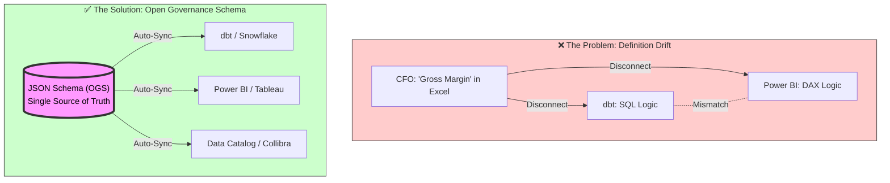

# **The Open Governance Manifesto**

### **Data is an Asset. Your Definitions are a Liability.**

We have spent the last decade solving the **Storage Problem**. Thanks to Apache Iceberg and Delta Lake, we can now store petabytes of data cheaply and reliably.

But we are still failing at the **Meaning Problem**.

Ask your Data Engineer for "Gross Churn" and you get one number. Ask your Tableau dashboard and you get another. Ask your Finance team and you get a third.  
This is Metric Drift. And in the age of AI, Metric Drift is fatal. If you feed conflicting definitions to an LLM, you don't get "Business Intelligence"—you get confident hallucinations.

## **The Solution: Headless Data Governance**

It is time to decouple the **Definition** (The *What*) from the **Tool** (The *How*).

Authentic Intelligence Labs introduces the Open Data Governance Schema (ODGS).  
ODGS is a vendor-neutral, JSON-based protocol that acts as the API for your business logic.

### **The Protocol: Write Once, Sync Everywhere**

Instead of defining "Revenue" three times (once in dbt, once in Looker, once in Excel), you define it once in ODGS.  
Our Sync Engine then compiles that definition into:

* SQL for your Data Warehouse (Snowflake/Databricks)  
* LookML for Looker  
* DAX for Power BI  
* **Semantic Context for your AI Agents**

### **The Killer Feature: Metric Provenance**

Generative AI is a "Reasoning Engine," not a "Knowledge Base." It is great at syntax, but terrible at facts.  
When an executive asks, "What was our Churn last month?", the AI hallucinates because it sees three different "Churn" columns in your warehouse.  
ODGS provides Metric Provenance.  
It forces the AI to look up the human-codified definition first. It provides the "Chain of Custody" for your business logic, ensuring that every AI answer can be traced back to a specific, version-controlled definition in your Git repo.

### **Why "Authentic Intelligence"?**

We believe AI is only as good as the rules you give it.

* **Artificial Intelligence** guesses the answer based on probability.  
* **Authentic Intelligence** knows the answer based on codified human expertise.

ODGS captures the *Authentic Intelligence* of your domain experts—the nuances, the exceptions, the business rules—and codifies them into a standard that AI can respect.

### **Join the Revolution**

The Table Format War is over. The Semantic War has just begun.  
Don't build another silo. Build on the Standard.
# 🏛️ The Open Data Governance Schema (ODGS)


# 🧩 Why now, why this?

> **The Open Standard for Headless Data Governance**  
> Decouples Business Logic from BI Tools

[]()
[]()
[](https://definitions.quirkyswirl.com)

[](https://opensource.org/licenses/Apache-2.0)
[](https://json.org)

## 📉 The Problem: Definition Drift

In the modern data stack, business logic is fragmented. The definition of `Gross Margin` in dbt often conflicts with the DAX formula in Power BI, which differs from the calculation in Tableau.

**Result:** Executives don't trust the dashboard, and Data Engineers spend 40% of their time debugging "why the numbers don't match."

## 🚀 The Solution: Write Once, Sync Everywhere




The **Open Data Governance Schema (ODGS)** is a vendor-neutral JSON protocol that acts as the "API" for your business definitions. By decoupling the **Definition** (The "What") from the **Tool** (The "How"), you achieve Headless Governance.

### How it works

```json
// example: standard_metrics.json
{
  "metric_id": "KPI_102",
  "name": "Gross_Margin",
  "domain": "Finance",
  "calculation_logic": {
    "abstract": "Revenue - COGS",
    "sql_standard": "SUM(gross_sales) - SUM(cost_of_goods)",
    "dax_pattern": "[Total Sales] - [Total Cost]"
  },
  "owner": "CFO_Office",
  "quality_threshold": "99.5%"
}
```

## 📂 The Protocol Structure

This repository contains the core schemas that define the "Alphabet" of Data Governance:

| File | Purpose |
| :--- | :--- |
| **`standard_metrics.json`** | The "Golden Record" for KPIs. Define logic, ownership, and sensitivity here. |
| **`standard_dq_dimensions.json`** | The 60 industry-standard dimensions of data quality (Accuracy, Timeliness, Completeness, etc.). |
| **`standard_data_rules.json`** | Technical validation rules (Regex patterns, null checks, referential integrity). |
| **`root_cause_factors.json`** | A standardized taxonomy for *why* data breaks (e.g., `Process_Gap` vs `Integration_Failure`). |
| **`business_process_maps.json`** | Maps how data entities flow through the business lifecycle. |

## ✅ Validation & CI/CD Integration

The repository includes a **validator script** that enforces the governance schema:

```bash
python3 scripts/validate_schema.py
```

**Output:**
```
🔍 Running Open Governance Schema Validator...
✅ Loaded 72 metrics.
✅ Loaded 50 data rules.
🎉 All Governance Checks Passed!
```

### CI/CD Integration

Add this to your GitHub Actions workflow to enforce governance standards:

```yaml
- name: Validate Governance Schema
  run: python3 scripts/validate_schema.py
```

This ensures that all metrics and rules have:
- Unique IDs
- Assigned owners
- Defined domains
- Clear calculation logic

---

## 📦 Installation

### NPM (Node.js)

```bash
npm install odgs
```

Usage:
```javascript
import { standardMetrics } from 'odgs';
// or
const { standardMetrics } = require('odgs');
```

### PyPI (Python)

```bash
pip install odgs
```

Usage:
```python
from odgs import standard_metrics
```

## 🛠 Usage & Implementation

### Option A: Build your own Sync Engine

Fork this repository. Use these JSON files as the configuration layer in your CI/CD pipeline. Write Python/Node parsers to inject these definitions into your tools (dbt `schema.yml`, Power BI XMLA, etc.).

### Option B: The Reference Implementation

If you prefer a managed "Headless Governance" layer that natively supports ODGS and handles the sync to Power BI/dbt automatically, feel free to see the art of possible with these end-state applications built with the same data:

*   **[Clavis](https://clavis.iyer.dev/)** (Plain HTML, CSS, JS)
*   **[Chartr](https://chartr.quirkyswirl.com/)** (React v2)

These examples demonstrate the end outcome for the business user of what the Open Data Governance Schema can do.

## Commercial Managed Service Partners

For commercial managed services, please visit:
*   **[QuirkySwirl](https://quirkyswirl.netlify.app/about)** 

-----

## 📄 License

This project is licensed under the **Apache License 2.0** - see the [LICENSE](LICENSE) file for details.

Copyright © 2025 [Authentic Intelligence Labs](https://github.com/Authentic-Intelligence-Labs)

---

**Contributing:** We welcome Pull Requests to expand the `dq_dimensions` or refine the `root_cause_factors` taxonomy.