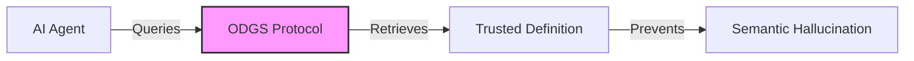

# 🦅 ODGS: The Open Data Governance Schema

[](https://opensource.org/licenses/Apache-2.0)
[](https://pypi.org/project/odgs/)
[](https://www.npmjs.com/package/odgs)
[]()
[](docs/manifesto/ai_safety.md)

> **"Data is an Asset. Your Definitions are a Liability."**

Welcome to the official documentation for **ODGS**—the Operating System for Enterprise AI Context.

---

## 📚 Documentation Suite

We have split our documentation into two tracks to serve both the Visionary and the Engineer.

### 🏛️ [The Manifesto (Business Vision)](docs/manifesto/philosophy.md)
*For CDOs, AI Officers, and Executives.*
*   **[Philosophy](docs/manifesto/philosophy.md)**: Why "Headless" is the only future.
*   **[AI Safety & Hallucinations](docs/manifesto/ai_safety.md)**: The $10M problem we solve.
*   **[Strategic Roadmap](docs/manifesto/roadmap.md)**: From Data Governance to "Context Engine".

### 🛠️ [The Protocol (Technical Manual)](docs/technical/architecture.md)
*For Data Engineers, Analytics Engineers, and Architects.*
*   **[System Architecture](docs/technical/architecture.md)**: How it works (Mermaid Diagrams).
*   **[The Ingredients](docs/technical/the_ingredients.md)**: API Reference for all 7 JSON Schemas.
*   **[CLI Reference](docs/technical/cli_reference.md)**: Command guide (`odgs init`, `validate`, `build`).
*   **[BI Adapters](docs/technical/adapters.md)**: Integration guides for dbt, PowerBI, Tableau.

---

## 🚀 Quick Start

```bash
# 1. Install the CLI
pip install odgs

# 2. Check your AI Safety Score
odgs validate --mode=strict
```

---

## 🧩 The Logic
*(From [Architecture](docs/technical/architecture.md))*



*Copyright © 2025 Authentic Intelligence Labs*
