# 🏗️ System Architecture

**Headless Data Governance** means unbundling the "Business Logic" from the "Execution Engine".

## The High-Level Flow

```mermaid
graph TD
    subgraph PROBLEM ["❌ The Siloed Reality"]
        A[CFO: 'Gross Margin' in Excel] -->|Disconnect| B[dbt: SQL Logic]
        A -->|Disconnect| C[Power BI: DAX Logic]
        B -.-|Mismatch| C
    end

    subgraph SOLUTION ["✅ The ODGS Architecture"]
        D[("JSON Schema (ODGS)
        Single Source of Truth")] 
        
        D -->|Compiles to| E[dbt Semantic Layer]
        D -->|Compiles to| F[Power BI TMSL]
        D -->|Compiles to| G[Tableau XML]
        D -->|Feeds| H[AI Agent Context]
    end

    style D fill:#4CAF50,stroke:#333,stroke-width:4px,color:white
    style PROBLEM fill:#ffcccc,stroke:#333,stroke-width:1px
    style SOLUTION fill:#ccffcc,stroke:#333,stroke-width:1px
```

## detailed Component Diagram

The ODGS Ecosystem consists of three layers:

1.  **The Protocol (Core):** definitive JSON files.
2.  **The CLI (Control):** validations and build orchestration.
3.  **The Adapters (Sync):** logic translators for downstream tools.

## The "Context Engine" for AI

When an AI Agent queries ODGS, it doesn't just get a column name. It gets a **Knowledge Graph**.

